> **&#x26A0;** I decided to make my fellowship application public. This is the original apllication by context, formatting is done due to the move to markdown. Spelling mistakes where fixed. More about processing can be found here: https://processing.org/


<h1 style="font-size:12vmin">
E X T A N T<br>
G U I<br>
L I B R A R Y
</h1>

Application for:
<h2>Processing Fellowship Program 2019</h2>

Doeke Wartena, 2018

<br style="font-size:15vmin">

>**ex.tant**  
<span style="font-family: 'serif'">still existing; not extinct; not lost or destroyed</span>

<br style="font-size:15vmin">


**Table of Contents**
- [My Goal](#my-goal)
- [Immediate vs Retained](#immediate-vs-retained)
- [Immediate GUI](#immediate-gui)
- [Showcase](#showcase)
    - [Button](#button)
    - [Toggle](#toggle)
    - [Radio](#radio)
    - [Input](#input)
    - [Knob](#knob)
    - [Slider](#slider)
    - [Range](#range)
    - [Slider 2D](#slider-2d)
    - [Color Picker](#color-picker)
- [Creating Custom Elements](#creating-custom-elements)
  - [Clock](#clock)
  - [Drumpad](#drumpad)
  - [File Viewer:](#file-viewer)
- [Tags](#tags)
- [Selectors](#selectors)
- [Events](#events)
- [Implementations](#implementations)
- [The Layout System](#the-layout-system)
- [A little bit more about IMGUI](#a-little-bit-more-about-imgui)
- [The name Extant](#the-name-extant)
- [Things left to do](#things-left-to-do)
- [Roadmap](#roadmap)
- [Why I am qualified for the work](#why-i-am-qualified-for-the-work)
- [What it means for Processing and the community](#what-it-means-for-processing-and-the-community)

<br style="font-size:15vmin">

Last year I received those kind words for my proposal:

> We’d like you to know that your proposal received high marks from the Committee, and made it to the longlist. We strongly encourage you to re-apply when we open the call again.

<br>

When I applied lasy year I didn’t have a single line of code. Now a year later I have worked a lot on my project, and so here is also a refined proposal.
I hope you enjoy the read.

---
# My Goal

My goal is to make a library for Graphic User Interfaces (GUI) named extant. This library will be for the java mode of processing. 

To sum up some of the goals that I want this library to meet:

- easy to implement
- easy to create own widgets
- easy to style elements
- great support for responsive layouts
- good performance
- cross platform support including mobile devices, android and raspberry PI
- correct what css did wrong
- proper error messages

# Immediate vs Retained

To talk about the root of the library I first have to explain the difference between retained and immediate.

Processing is really immediate by nature. For example to draw an ellipse we do:

```java
ellipse(width/2, height/2, 100, 100);
```

If Processing was retained it would have looked something like this:

```java
// global
Ellipse myEllipse;
// setup
myEllipse = new Ellipse(width/2, height/2, 100, 100);
// draw
myEllipse.draw();
```

Imagine the pain that would be!
That is like the pain of… creating a GUI in the year 2018...

Which often boils down to something like this:

```java
// global
Button myButton;
// setup
myButton = new Button(10, 10, 100, 20, "click me", "someCallback");
// global
void someCallback() { .. }
```

Well that time is over!

# Immediate GUI

With a immediate GUI mode the UI is reconstructed every frame. This sounds expensive but it is not. And the nature of it is that it is way more flexible to create and change an interface.
From now on I will refer to immediate graphic user interface as IMGUI.

To demonstrate a immediate UI mode I created the most basic example to explain this concept. I suggest to copy paste it and run it in processing.
Try adding a third button!

```java
void setup() {
 size(150, 130);
}

void draw() {
 
  hovered_item = 0;
 
  background(0);
 
  if (button(10, 10, "Button 1")) {
      println("Button 1 clicked!");  
  }
  if (button(10, 30, "Button 2")) {
      println("Button 2 clicked!");
  }
 
  if (!mousePressed) {
      active_item = 0;
  }
 
}


int hovered_item;
int active_item;

boolean button(int x, int y, String label) {
 
  int w = (int) (textWidth(label) * 1.2);
  int h = (int) (textAscent() + textDescent());
 
  int id = Thread.currentThread().getStackTrace()[2].getLineNumber();
 
  boolean mouse_inside = !(mouseX < x ||
                           mouseY < y ||
                           mouseX >= x + w ||
                           mouseY >= y + h
  );
 
  if (mouse_inside) {
    hovered_item = id;
    if (active_item == 0 && mousePressed) {
          active_item = id;
    }
  }
 
  fill(255, 255, 0);
  rect(x, y, w, h);
  fill(0);
  textAlign(CENTER, CENTER);
  text(label, x, y, w, h);
 
  if (!mousePressed && hovered_item == id && active_item == id) {
    return true;  
  }
  return false;
}
```

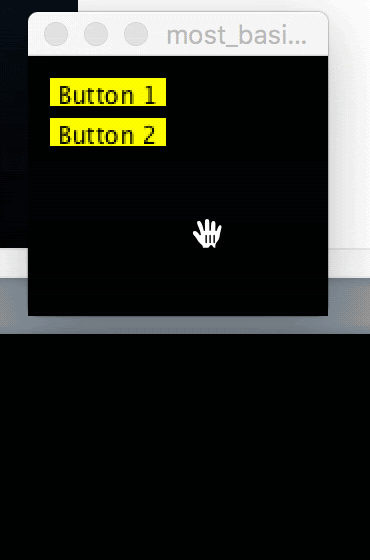

Well, ain't that a relief!

I want to point out a big thanks to Casey Muratori, a great inspiring programmer who came up with the concept of IMGUI.
From one of his blogs:


> I began to realize that “retained” GUI code design has all the same drawbacks that typically cause us to avoid using retained-mode APIs in graphics. I experimented with having the GUI code operate in a more immediate fashion, like an immediate-mode graphics API, and found that everything was simpler, more powerful, and…

Casey Muratori, “Immediate-Mode Graphical User Interfaces (2005)”, https://caseymuratori.com/blog_0001

# Showcase

Before I start talking in detail about the current state of the library and what is left to do, I wan’t to show what I have so far.

### Button

```java
// global
int bg_color;
// draw
if (on(CLICK, button("click me"))) {
   bg_color = (int) random(-16777216);
}
background(bg_color);
```


### Toggle

```java
// global
boolean show_settings;
// draw
toggle("show_settings");
```
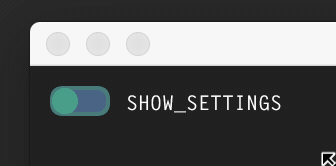

### Radio

```java
// global
String sort_by;
// draw
label("sort by");
radio("sort_by", "name", "kind", "size");
```
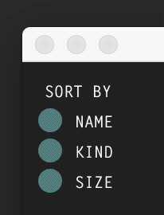

### Input

```java
// global
String name = "This is BANANAS!";
// draw
input("name");
```
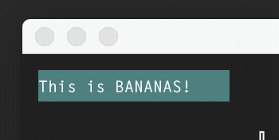

### Knob

```java
// global
float pitch;
// draw
knob("pitch", 0f, 255f);
```
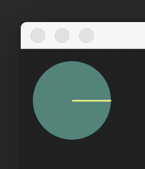

### Slider

```java
// global
float volume;
// draw
label("volume:");
slider("volume", 0f, 1f);
```
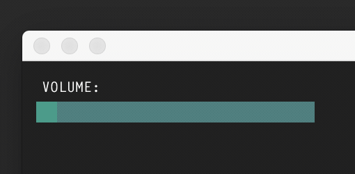

### Range

```java
// global
int min_year = 1950;
int max_year = 2018;
// draw
range("min_year", "max_year", 1900, 2018);
```
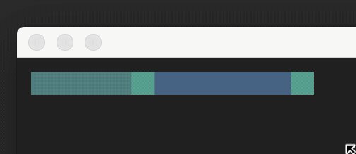

### Slider 2D

```java
// global
float x = 75, y = 30;
// draw
slider_2d("x", "y", 0, 0, 255, 255);
```
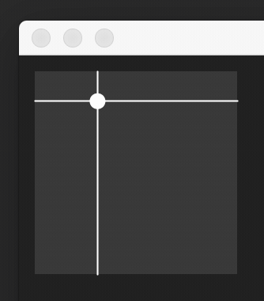

### Color Picker

This is a slider_2d with normal sliders where a custom draw procedure is implemented.

```java
// global
int c = color(200, 180, 50);
// draw
color_picker("c");
```
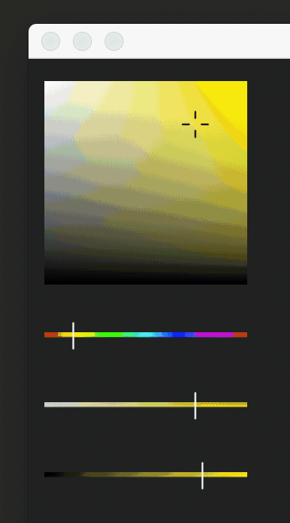

And there are more elements being worked on, like a dropdown, multi line input, color picker with a triangle, graphs, etc. .

# Creating Custom Elements

As I mentioned in the beginning, I want it to be easy to create own widgets and customize them. Lets start with a really simple one and then move on to a more complex example.

## Clock

Let’s make a simple digital clock (I keep it brief):

```java
Element clock() {
   Element clock = structure("clock", (e)-> {
       String time = nf(hour(), 2)+":"+nf(minute(), 2)+":"+nf(second(), 2);
       set_property(e, "label", time);
   });
   return clock;
}
```

We could already make a call to clock but nothing would appear cause we have nothing defining the layout or drawing it.
For the layout we can use:

```java
add_layout_solver($("clock"), (e, r)-> {
   String label = get_property_string(e, "label");
   r.w = textWidth(label) * 1.2f;
   r.h = textAscent() + textDescent() * 1.2f;
});
```

And for the drawing:

```java
add_draw_solver($("clock"), (e, r)-> {
   String label = get_property_string(e, "label");
   fill(50);
   noStroke();
   rect(r.x, r.y, r.w, r.h);
   fill(255);
   textAlign(CENTER, CENTER);
   text(label, r.x, r.y, r.w, r.h);
});
```

And here it is, our reusable digital clock!

```java
clock();
clock();
clock();
```
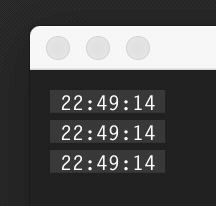

## Drumpad

As another example let’s make a really simple drumpad.

```java
Element[] drumpad(int rows, int cols) {
      
    push_structure("drumpad");

    for (int y = 0; y < rows; y++) {
        push_structure(y);
        for (int x = 0; x < cols; x++) {
            push_structure(x);
            on_same_line();
            
            Element button = button();
            // IMPORTANT this is temp, eventualy you should
            // be able to get this from the structure path
            set_property(button, "row", y);
            set_property(button, "col", x);

            on_same_line();
            pop_structure();
        }
        pop_structure();
    }
    return pop_structure_and_return_elements();
}
```

As with any widget, it should always return all the elements created.


Ok to use our drumpad now we can call:

```java
on(CLICK, drumpad(5, 5), $("button"), (e)-> {
   int row = get_property_int(e, "row");
   int col = get_property_int(e, "col");
   println(row, col);
});
```
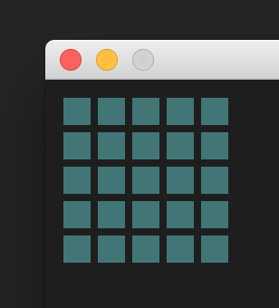


All neat, but now lets style the button:

```java
add_draw_solver( $("drumpad", "button"),
   (e, r)-> {
       fill( on(PRESS, e)  ? color(240, 240, 200)
           : on(HOVER, e)  ? color(220, 220, 150)
                           : color(200, 200, 0));
       rect(r.x, r.y, r.w, r.h);
   }
);
```
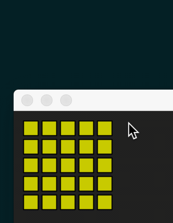


Here a another example where we add another solver for a draw procedure. In this case for when both the row and the column index is odd.

```java
add_draw_solver( $("drumpad", odd(),  odd(), "button"),
   (e, r)-> {
       fill(0);
       rect(r.x, r.y, r.w, r.h);
   }
);
```
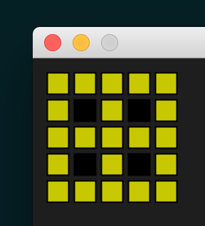

## File Viewer:

Here is one of the use cases where more things come together.

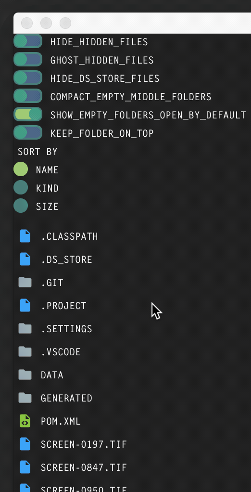

Here is the part responsible for drawing a row:

```java
push_structure("row");
increment_depth(depth); on_same_line();
icon(file);             on_same_line();
label(file_path);
Element[] elements = pop_structure_and_return_elements();
// next elements is checked for click etc.
```

Here is our icon call:

```java
Element icon(File f) {
   String extension;
   if (f.isDirectory()) {
       boolean is_folder_open  = folder_open.getOrDefault(f.toString(), false);
       extension = is_folder_open ? "folder-open" : "folder";
   }
   else {
       extension = f.getName().substring(f.getName().lastIndexOf(".")+1);
   }
   return structure("icon", (e) -> set_property(e, "label", extension));
}
```

And the layout solver:

```java
add_layout_solver(
   $("icon"),
   (e, r) -> {
       r.h = 16;
       r.w = 16;
    }
);
```

And as last the draw solver:

```java
add_draw_solver(
   $("icon"),
   (e, r) -> {
       String label = (String) get_properties(e).get("label");
       shape(get_icon(label), r.x, r.y, r.w, r.h);
   }
);
```

# Tags

Tags are being reworked at the moment but I wanted to mention them anyway.
Tags are added to an element instead of being part of the structure path.
Tags have a lower priority then a structure path. They take up 1 bit and the maximum at the moment is 32 tags. Which seems more then enough at this stage.
Here are some examples that might give you an idea.

```java
"--scroll_x", 
"--scroll_y", 
"--clip_x", 
"--clip_y",
"--disabled",  
"--highlighted", 
"--state-success",
"--state-danger"
```

# Selectors

Above we used selectors like: `$("drumpad", odd(),  odd(), "button")`.
At the moment there are the following selectors:

```java
"structure" // for example "button"
odd()
even()
range(start, stop)
index()
index(i)
"--tag" // for example "--warning"
```

A solver will be selected based on the selectors. This also means that if there is no implementation loaded for e.g. the color picker with the hue saturation and brightness slider that the sliders will be drawn in their default style.


# Events

For the `on(...)` we saw above in `if (on(CLICK, button())) {`; we have the following events:

```java
HOVER
HOVER_START
HOVER_END
TOUCH
TOUCH_START
TOUCH_END
PRESS
PRESS_START
PRESS_END
CLICK
VALUE_CHANGED
DRAG
DOUBLE_CLICK
```

Another example:

```java
if(on(VALUE_CHANGED, slider("volume", 0f, 1f))) {
   println("change");
}
```

The great thing about the above is that we can prevent doing calculations when nothing has changed.

We also have as we saw in the drumpad example:

```java
on(CLICK, drumpad(5, 5), $("button"), (e)-> {
 // ...
});
```

Here we use a selector and a callback, which is great if we wan’t to target a specific thing from a widget.

Time:

In the toggle example we saw that it was animated.
That was done using:

```java
int time_since_click = time(SINCE | LAST | CLICK, e);
float t = time_since_click == -1 ? 1 : min(time_since_click, 200f) / 200f;
// now use t to animate
```

The time procedure can take any of the events listed before. Without using `SINCE` it will return the timestamp of the event.
The `LAST` might be removed cause it could be made obsolete.


# Implementations

At the moment I have one implementation. A implementation is responsible of drawing the GUI. It holds the solvers for all the elements. To make a new implementation the following interface has to be implemented:

```java
public interface UI_Implementation {
   public void add_layout_solver(int[] selector, Layout_Solver layout_solver);
   public void add_draw_solver(int[] selector, Draw_Solver draw_solver);
   public void add_hit_test_solver(int[] selector, Hit_Test_Solver hit_test_solver);
   public void prepare();
   public void process_layout(Element e);
   public boolean process_hit_test(Element elm, float x, float y);
   public void draw_all(ArrayList<Element> to_draw);
   public void push_packer();
   public void pop_packer();   
}
```

Making a new implementation is really easy, I made as a test a SVG implementation before.
In Affinity Designer I had auto export on every change on, and in processing I was checking the svg timestamp to see if the file was changed. If it was it would hot load the newer svg.
A really nice way for interactive UI design where you can actually test the UI instead of only see it. (But thinking about it, this could be done with only solvers).

Switching of an implementation is nothing more then initialising it and binding it to the library context.

```java
set_ui_implementation(context, new UI_Implementation_01(this, g));
```

It should even be possible to make a 3D interface (dont ask me why), 
the steps to do that are:
- creating a layout system that adds a depth to a element using the properties system
- create a 3d packer (or just use the 2d one)
- add custom hit solvers so it is not using a 2d hit test
- add draw solvers to draw 3d elements

Eventually I hope users will make a lot of custom implementations and share those.
From self created interfaces to linux, osx, ios, android and windows interfaces.
How cool would it be to change from a osx interface to a linux interface with only one line of code? 

# The Layout System

One big aspect is layout. Here is a early test based on CSS grid.
CSS grid is one of the few things css did actually right(, except they had to F-up somewhere so they started counting indexes starting at 1 instead of 0).

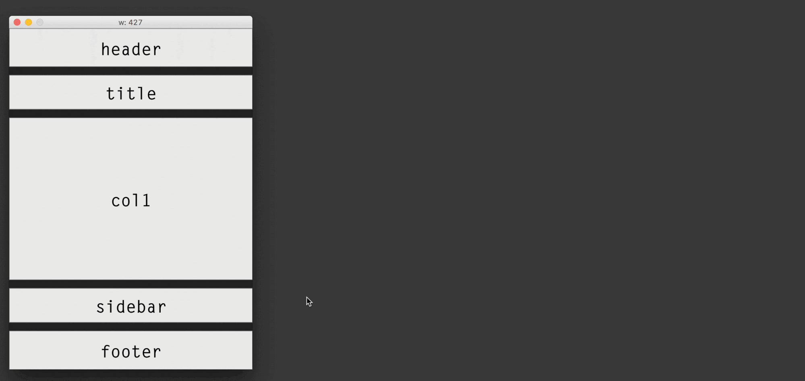

Although this is a good start, it is totally isolated from the library at the moment.
Which might sound like a good thing but it is not cause ideally there is one eco system when it comes to structure and elements.

When the layout system evolves more it might have big implications on current existing things. This could for example be that you can change if a label is on the left or right of a slider by defining a layout. Time will tell.


Here is how it’s currently done (I only show the first 3 layouts instead of all 5 from the gif):
Pay attention to the rows and columns of the strings.

```java
// global
ArrayList<Layout> layouts = new ArrayList<Layout>();
// setup
Layout layout_default = create_layout(0, 0,
       columns(1),
       rows(1, 1, 4, 1, 1),
       "header",
       "title",
       "main",
       "sidebar",
       "footer"
   );

   Layout layout__480 = create_layout(480, 0,
       columns(1.5f, 1),
       rows(1, 1, 1, 1),
       "header header",
       "main  title",
       "main  sidebar",
       "footer footer"
   );

   Layout layout__768 = create_layout(768, 0,
       columns(2, 1, 1),
       rows(1, 1, 2),
       "title title   title",
       "main  header  header",
       "main  sidebar footer"
   );


   layouts.add(layout_default);
   layouts.add(layout__480);
   layouts.add(layout__768);
```

# A little bit more about IMGUI

Another great thing about imgui is that the gui is always in sync with your data.
For example, if we have the following:

```java
// global
float x = 0.3f;
// draw
if (frameCount == 180) {
   x = 0.8f;
}
label(""+frameCount);
slider("x", 0f, 1f);
```

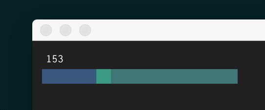


Then on frame 180, the slider thumb will change to it’s correct position. 
In most retained interfaces that I know of, this would not be the case, leading to the UI state not representing the correct data state.


# The name Extant

>**ex.tant**  
<span style="font-family: 'serif'">still existing; not extinct; not lost or destroyed</span>

To clarify why I named it Extant (it might change). In the beginning the library was a true immediate mode GUI library. This mean on a call like `if(on(CLICK, button()))` a id for that button is created, if it is hovered or pressed that id got stored in the `id_hovered` and/or `id_pressed` variable. Then the button is drawn and then after the scope no additional data was left about that button.
All great, but when it comes to things like overlap, layout or scrolling there is certain data required to accomplish that behaviour.

In short, now there are two buffers, one for Elements from the last frame and one buffer for Elements for the current frame. Those elements can be reused for any element prefered (e.g. a Element used as a button can be used for a toggle next frame).
Because of this we can make assumptions of how the current frame will look based on the last frame. It is not fully retained but neither it is fully immediate, therefor I call it extant, a synonym for that is surviving.

(But maybe I name it Mantis, after a animal that eats its own kind…)


# Things left to do

To keep it a bit more brief I sum op some of the things of my todo list.
Keep in mind from all the things shown above, a lot of it needs polishing / refactoring.

The road ahead is still a long road!

In no particular order:
- a docking / undocking system for panels
- drag and drop of elements
- multiline text editor
- rework some of the edge cases where the widgets don't work correct
- noLoop mode, I already have a working prototype of this. Great to save battery on mobile devices. At the start of a frame interaction gets checked against the buffer of the last frame. If there is no state change then there is a return. (It needs work on specific widgets / cases).

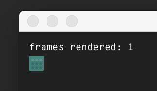

- shader implementations for the colorpicker
- improved clipping and scrolling
- rotations (maybe only 90 degrees rotations, but sometimes I wan’t 45 degrees rotations for specific things) (this is one of the hardest problems I have to solve)
- a inspector for debugging purposes, (I have a small prototype for this over a socket)
- maybe update processings preprocessor (lambda’s make the library great, but I would prefer if someone else would dig into the preprocessor).
- better font rendering for processing (probably a fellowship on it’s own)
    - the difference between the default renderer, and P2D is huge
- the quality is poor, rasterization with hinting and subpixel rendering would be great
- look into multi user support again, I had this before where more then one user could use a interface at the same time. It was removed cause it required to much maintanance and overcomplicated things. I like the idea for interactive installations where multiple people are around a touchscreen table for example.
- mobile device support, I have a basic sketch working in android mode but it needs more work. For example keyboard input, and:
- dpi support
- animations and transitions
- overlap / tooltips
- layers, there is basic support now, but I don’t wan’t stupid things like css `z-index: 9999;`.
- widgets in tooltips etc.
- right mouse support etc.
- a graph editor (probably after the first release)
- documentation, not only how to use it, but also how to create new widgets cause there are a few simple rules to follow.
- refined packer, the classes a bit with a layout system, but the on_same_line and push_packer / pop_packer can be problematic in it’s current state.

# Roadmap

First of all, I don’t have a todo list in order. I continue working like I do now. Well I do tend to fix bugs directly. I always tro to focus on things that have the most influence. But it also depends on the time I have to work on something at a day or in the upcoming days. Sometimes I touch a problem so it can sink down again until I think of a solution. I can leave things open cause I know a solution to a problem can reveal itself when stumbling up something else. And once in a while I want todo something out of the main scope like looking into multi user support cause it can be refreshing and gives a different view on the defined structures.

Eventually when I have the layout system, rotations and cross platform support and a proper looking implementation then I want to work on documentation. After that enroll a private beta to a limited group of people I know by person or reputation. Based on their feedback I will refine the things required.

And at that point have a public release, and a repository for custom implementations created by other users.

# Why I am qualified for the work

I started with processing around Juni 2010. 
Over the years I not only learned how to use it but I learned the inner workings of Processing as well. I have experience in multiple languages such as *java*, *javascript*, *python*, *php*, *c*, *c++* and *c#*.
I run a hardware software lab at ArtEZ, university of the Arts, where I help students with processing from time to time. For the rest I do freelance work for clients where processing is often my main tool.

I have written libraries before, and over the years my vision changed a lot regarding to what makes a good library and how to write easy to read code.

I think CSS is terrible but I do understand the power of it. I want to have a powerful GUI library in every aspect possible that beats css and I will not rest till I fullfill this mission.
I am willing to do things over and over again cause in the end it will save me and a lot of other people time.

# What it means for Processing and the community

My project will lower the floor of making user interfaces in processing. Therefor the speed of prototyping can increase. By making the experience of creating a UI more smooth it will become more easy to make complex projects. Changing values and re-running the sketch should be something of the past. It could steer processing in a direction where sketches become litle tools.

Eventually I hope to prove that the system is so strong that we can remake the PDE to work with it.

For the community, it is not targeted at a small group of the community but it is targeted at the community as a whole.
